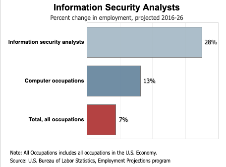
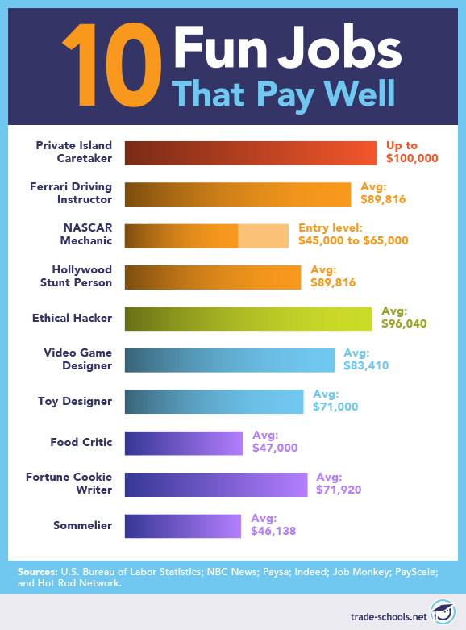
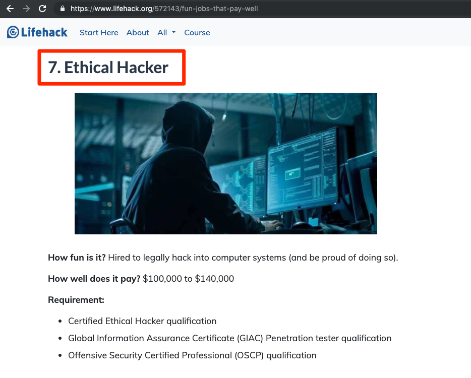

<!-- .slide: data-transition="zoom" style="text-align: left;" -->
# The Dark Arts

#### The Adversarial Side of InfoSec

Note:
This is a note test

---

<!-- .slide: data-transition="zoom" style="font-size: 30px;" -->
## InfoSec Job Outlook

</img>

---

<!-- .slide: data-transition="zoom" style="font-size: 30px;" -->
## Annual Data Breach Stats

</img>

---

<!-- .slide: data-transition="zoom" style="font-size: 30px;" -->
## Top 10 Interesting Jobs

<section>
    </img><!-- .element: class="fragment fade-up" -->
    </img><!-- .element: class="fragment fade-up" -->
</section> 

---

<!-- .slide: data-transition="zoom" style="text-align: left; font-size: 30px;" -->
## This Guy 
* Matt Burch, Principle Security Consultant<!-- .element style="margin: 5px 0;" -->
* 15yrs InfoSec Consulting / 6yrs Penetration Testing<!-- .element style="margin: 5px 0;" -->
* Associate Degress + Numerous Certifications<!-- .element style="margin: 5px 0;" -->

<!-- .element style="display: table; width: 90%; float: right" -->
  
OSCP
<!-- .element style="float: left; width: 30%; margin: 5px 0;" -->
  
OSCE
<!-- .element style="float: left; width: 30%; margin: 5px 0;" -->
  
CCNA
<!-- .element style="float: left; width: 30%; margin: 5px 0;" -->
  
CCNP
<!-- .element style="float: left; width: 30%; margin: 5px 0;" -->
  
CCDA
<!-- .element style="float: left; width: 30%; margin: 5px 0;" -->
  
SNRS
<!-- .element style="float: left; width: 30%; margin: 5px 0;" -->
  
SNPA
<!-- .element style="float: left; width: 30%; margin: 5px 0;" -->
  
CCSE
<!-- .element style="float: left; width: 30%; margin: 5px 0;" -->
  
CC STS
<!-- .element style="float: left; width: 30%; margin: 5px 0;" -->
  
JNCIS-ES
<!-- .element style="float: left; width: 30%; margin: 5px 0;" -->
  
Cisco IPS
<!-- .element style="float: left; width: 30%; margin: 5px 0;" -->
  
CSE RSA SecurID
<!-- .element style="float: left; width: 30%; margin: 5px 0;" -->
  
CSE RSA enVision
<!-- .element style="float: left; width: 40%; margin: 5px 0;" -->

</img><!-- .element style="hight: 200px; width: 250px; position: absolute; top: -90px; right: -50px;"-->

---

<!-- .slide: data-transition="zoom" style="text-align: left; font-size: 30px;" -->
## Job Perks<!-- .element: style="text-align: center" -->

* Legal license to steal millions of CC / SSN / etc..<!-- .element style="margin: 5px 0;" -->
* Legal license to break into buildings / Bypass Security alarms / Rifle through people’s desks<!-- .element style="margin: 5px 0;" -->
* High demand / Zero unemployment rate<!-- .element style="margin: 5px 0;" -->
* High visibility<!-- .element style="margin: 5px 0;" -->
* Remote office / Home office<!-- .element style="margin: 5px 0;" -->

---

<!-- .slide: data-transition="zoom" style="text-align: left; font-size: 30px;" -->
## InfoSec Job Market <!-- .element: style="text-align: center" -->

* <= 4yr degree<!-- .element style="margin: 5px 0;" -->
* Work experience<!-- .element style="margin: 5px 0;" -->
* Alternative education<!-- .element style="margin: 5px 0;" -->
* Reputation<!-- .element style="margin: 5px 0;" -->
  * Blogs<!-- .element style="margin: 5px 0;" -->
  * Published papers<!-- .element style="margin: 5px 0;" -->
  * Social Media presence<!-- .element style="margin: 5px 0;" -->
  * Public forum talks<!-- .element style="margin: 5px 0;" -->

---

<!-- .slide: data-transition="zoom" style="text-align: left; font-size: 30px;"-->
## Knowledge Baseline<!-- .element: style="text-align: center" -->

* Superhuman troubleshooting / problem solving skills<!-- .element style="margin: 5px 0;" -->
* IT / Network Administration<!-- .element style="margin: 5px 0;" -->
* Programming experience<!-- .element style="margin: 5px 0;" -->
* Vulnerability management / exploitation<!-- .element style="margin: 5px 0;" -->
* Strong writing / communication skills<!-- .element style="margin: 5px 0;" -->

---

<!-- .slide: data-transition="zoom" data-background="img/wideopen.jpg" -->
## The Adventure

---

<!-- .slide: data-transition="zoom" style="text-align: left; font-size: 30px;"-->
## Career Paths <!-- .element: style="text-align: center" -->

<!-- .element style="display: table; width: 110%" -->
    
<!-- .element style="float: left; width: 50%;" -->
        <ul><!-- .element style="list-style-type:disc" -->
            <li>Researcher</li><!-- .element style="margin: 5px 0;" -->
            <li>Red Team</li><!-- .element style="margin: 5px 0;" -->
            <li>Consultant</li><!-- .element style="margin: 5px 0;" -->
            <li>Nation State - aka Spy</li><!-- .element style="margin: 5px 0;" -->
        </ul>
    

    
<!-- .element style="float: left; width: 50%;" -->
        <ul><!-- .element style="list-style-type:disc" -->
            <li>Web Application Testing</li><!-- .element style="margin: 5px 0;" -->
            <li>MD Testing</li><!-- .element style="margin: 5px 0;" -->
            <li>IoT / Hardware Testing</li><!-- .element style="margin: 5px 0;" -->
            <li>Physical Security Testing</li><!-- .element style="margin: 5px 0;" -->
            <li>Network Penetration Testing</li><!-- .element style="margin: 5px 0;" -->
            <li>Code Review</li><!-- .element style="margin: 5px 0;" -->
        </ul>
    

---

<!-- .slide: data-transition="zoom" style="text-align: left; font-size: 30px; margin: 5px 0;"-->
## Job Market<!-- .element: style="text-align: center" -->

* Mostly Consulting<!-- .element style="margin: 5px 0;" -->
  * Optiv<!-- .element style="margin: 5px 0;" -->
  * NetSPI<!-- .element style="margin: 5px 0;" -->
  * Spider Labs<!-- .element style="margin: 5px 0;" -->
  * Offensive Security<!-- .element style="margin: 5px 0;" -->
* Corporate Red Team<!-- .element style="margin: 5px 0;" -->
  * Ford<!-- .element style="margin: 5px 0;" -->
  * Walmart<!-- .element style="margin: 5px 0;" -->
  * SAP<!-- .element style="margin: 5px 0;" -->

---

<!-- .slide: data-transition="zoom" style="text-align: left; font-size: 30px; "-->
## Networking Proficiency<!-- .element: style="text-align: center" -->

* Architecture design is overlooked<!-- .element style="margin: 5px 0;" -->
  * OSI Model is foundation<!-- .element style="margin: 5px 0;" -->
  * Layer2 / Layer3 communication vulnerabilities<!-- .element style="margin: 5px 0;" -->
* Security is network architecture dependant<!-- .element style="margin: 5px 0;" -->
  * Internet accessible services / applications<!-- .element style="margin: 5px 0;" -->
  * Web filtering / Firewall controls / QoS<!-- .element style="margin: 5px 0;" -->
* Architecture strategies are lost across multiple mediums<!-- .element style="margin: 5px 0;" -->
  * Wireless / Cellular / WAN<!-- .element style="margin: 5px 0;" -->
  * ISP controls are reaching into the corporate L2 domain<!-- .element style="margin: 5px 0;" -->

---

<!-- .slide: data-transition="zoom" style="text-align: left; font-size: 30px; "-->
## Administration Background <!-- .element: style="text-align: center" -->

* Security starts with IT policy<!-- .element style="margin: 5px 0;" -->
  * Configuration baseline<!-- .element style="margin: 5px 0;" -->
  * Password policy / Account deligation<!-- .element style="margin: 5px 0;" -->
* Audit / Account log details<!-- .element style="margin: 5px 0;" -->
  * Log trails<!-- .element style="margin: 5px 0;" -->
  * Information storage / organization<!-- .element style="margin: 5px 0;" -->
* Corporate behavior model<!-- .element style="margin: 5px 0;" -->
  * IT support call process<!-- .element style="margin: 5px 0;" -->
  * User / IT interaction<!-- .element style="margin: 5px 0;" -->
  * User identity verification<!-- .element style="margin: 5px 0;" -->

---

<!-- .slide: data-transition="zoom" style="text-align: left; font-size: 30px;"-->
## Alternative Education<!-- .element: style="text-align: center" -->

* CTF Events / Conferences (GrrCon, BSides, DefCon, Shmoocon, etc..)<!-- .element style="margin: 5px 0;" -->
* Vulnerable VMs<!-- .element style="margin: 5px 0;" -->
  * https://blog.rapid7.com/2011/12/23/where-can-i-find-vulnerable-machines-for-my-penetration-testing-lab/<!-- .element style="margin: 5px 0; font-size: 20px;" -->
* Social Media – (CobalStrike, PowerSploit, etc.)<!-- .element style="margin: 5px 0;" -->
* Bug Bounties<!-- .element style="margin: 5px 0;" -->
* Self Focused Research<!-- .element style="margin: 5px 0;" -->
* Employer Education Programs<!-- .element style="margin: 5px 0;" -->

</img><!-- .element style="hight: 200px; width: 300px; position: absolute; bottom: -30px; right: -30px;"-->

---

<!-- .slide: data-transition="zoom" style="text-align: left; font-size: 30px;" -->
# Exit 0; - Questions??

#### mburch44@gmail.com